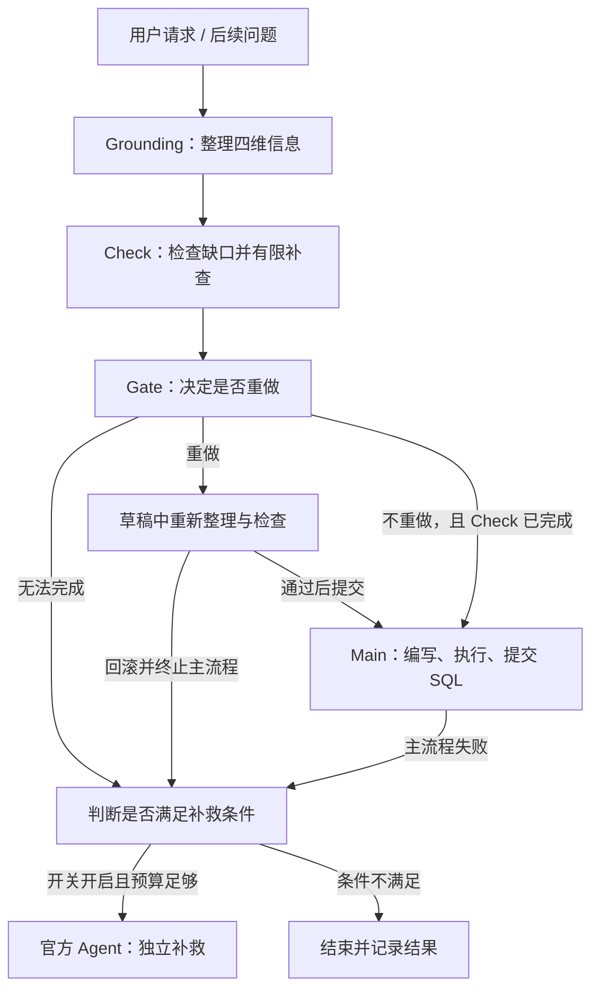

# Valibra

基于 BIRD-Interact-ADK 的交互式 Text-to-SQL 研究框架。

在线报告：[中文版](https://tiancigao.github.io/Valibra-site/) · [Русская версия](https://tiancigao.github.io/Valibra-site/ru/)

包含框架设计、实际案例、600 题评测分析与结果表下载。

Valibra 在编写 SQL 前，先整理任务涉及的表、连接关系、字段含义和业务知识，再检查信息是否足够。信息不足时补查或澄清；主流程无法完成时，在剩余预算内交给官方 Agent 补救。

[框架说明](docs/architecture.md) · [安装与运行](docs/getting-started.md) · [600 题结果](docs/releases/2026-09-16/README.md) · [文档导航](docs/README.md)

当前正式代码位于 **`research/sql-grounding-v1`** 分支。已发布代码快照为 [`74c4588`](https://github.com/TianciGao/Valibra/commit/74c45884f0bc0084cefff156ef01840c1f2cd07f)；本 README 后续整理不改变该版本的运行逻辑。

## 方法

四个维度是一份逐步更新的信息表，而不是四个独立 Agent：

| 维度 | 内容 | 作用 |
| --- | --- | --- |
| `tables` | 任务涉及的表 | 确定数据范围 |
| `join_keys` | 表之间的连接条件 | 确定数据如何关联 |
| `column_mapping` | 用户概念与数据库字段的对应关系 | 确定问题中的词指向哪些字段 |
| `domain_knowledge` | 有来源的公式、规则等知识 | 补足仅凭表结构无法确定的业务含义 |

Structure 整理前两个维度，Mapping 整理字段对应关系，Knowledge 整理业务知识。Check 判断能否继续，Gate 决定是否需要重做部分 Grounding。



图中省略了澄清暂停与恢复等分支，完整说明见[框架与数据流](docs/architecture.md)。

当前 Main 是受约束的 SQL 编写阶段：接收原请求、后续问题、四维信息和已回答的澄清，只使用 `execute_sql` 与 `submit_sql`。它不是可以重新自由调查语义的官方 Agent；后者用于 fallback。

## 同题 600 题结果

评测模式为 **a-interact**，主模型为 **GLM-5.2**，运行配置为 **leaderboard**。P1 表示第一阶段通过，Full 表示两个阶段均通过。

| 指标 | 基线 | Valibra | 变化 |
| --- | ---: | ---: | ---: |
| P1 通过 | 144 / 600 | 150 / 600 | +6 |
| Full 通过 | 79 / 600 | 75 / 600 | −4 |
| Reward | 124.5 | 127.5 | +3.0 |
| 输入 token | 74,548,984 | 79,026,960 | +6.01% |
| 输出 token | 7,723,158 | 24,231,520 | +213.75% |
| 总 token | 82,272,142 | 103,258,480 | +25.51% |

Reward = `0.7 × P1 通过数 + 0.3 × Full 通过数`。

这是一项有限改善：P1 和 Reward 上升，Full 下降，token 消耗增加。不能据此认为整体能力或成本效率已经超过基线。

- 逐题对比：47 题提高，47 题下降，506 题不变。
- 主流程取得 P1 通过 84 题、Full 通过 42 题；fallback 触发 377 题，新增 P1 通过 66 题、Full 通过 33 题。
- token 包含 Grounding、Main/fallback 和用户模拟器；旧汇总遗漏 Grounding 用量，“总 token 降低”的旧结论不再采用。
- 统计只覆盖最终计分轨迹的已报告用量；18 题采用经授权的替代运行，另有 20 次 Grounding 尝试未报告用量。

[完整口径与限制](docs/releases/2026-09-16/README.md) · [机器可读汇总](docs/releases/2026-09-16/core_results.json) · [源码与配置指纹](docs/releases/2026-09-16/candidate_manifest.json)

发布前另修复了审计日志的大小限制，没有重跑 600 题；成绩仍对应修复前的冻结源码。

## 开始使用

先克隆正式分支，再按[安装与运行说明](docs/getting-started.md)准备 Python 环境、依赖和配置：

```bash
git clone --branch research/sql-grounding-v1 https://github.com/TianciGao/Valibra.git
cd Valibra
```

安装依赖后，可先运行不调用模型和数据库的离线测试：

```bash
python -m pytest -q -p no:cacheprovider tests
```

发布时，本地完整测试为 **513 通过、5 跳过**；不含数据集的发布副本为 **511 通过、7 跳过**。跳过项及原因见[测试说明](tests/README.md)。

真实评测需要另行准备数据集、PostgreSQL、主模型和用户模拟器的访问凭据。Grounding 与 Main 的模型配置相互独立；默认配置、上游脚本和历史批跑脚本不等同于本次 600 题配置。

## 仓库结构

```text
Valibra/
├── valibra_agent/       当前方法：Grounding、Check/Gate、Main 交接、fallback
├── system_agent/        官方 Agent、Prompt、工具及回调
├── user_simulator/      用户模拟与两阶段交互
├── db_environment/      数据库执行与评测服务
├── orchestrator/        任务调度与评测流程
├── shared/              配置、模型适配、数据库与公共类型
├── configs/             模型预设及历史基线配置
├── tests/               离线测试；historical/ 为已退役实验断言
├── scripts/             环境管理、评测辅助及历史运行脚本
├── docs/                方法、运行指南、版本说明与核心结果
├── evidence/            历史阶段验收记录，不是当前成绩入口
└── baseline/            初始代码快照的来源与校验信息
```

当前结果统一从 [`docs/releases/`](docs/releases/2026-09-16/README.md) 进入。不要将 `baseline/` 的旧依赖清单、`evidence/` 的阶段记录或已退役测试当作当前运行配置。

## 研究边界

Grounding 信息通过格式与来源检查，并不意味着语义一定正确。复杂字段选择、业务条件遗漏和跨阶段信息保留仍是主要风险。当前版本保留了草稿隔离、有限重试和日志审计，未启用已回滚的 lexical literal 强制约束实验。

仓库不提供完整逐题评测结果、参考 SQL、Provider 原始输出、数据库或密钥。核心结果以公开汇总形式提供，本地报告与原始轨迹不随代码发布。

## 来源与许可

本项目基于 BIRD-Interact-ADK，沿用 BIRD-Interact 的任务、官方工具与评测流程；Valibra 的实验结果不代表上游官方结果。

[上游项目及引用](docs/upstream/README.md#citation) · [BIRD-Interact](https://github.com/bird-bench/BIRD-Interact) · [MIT License](LICENSE)
