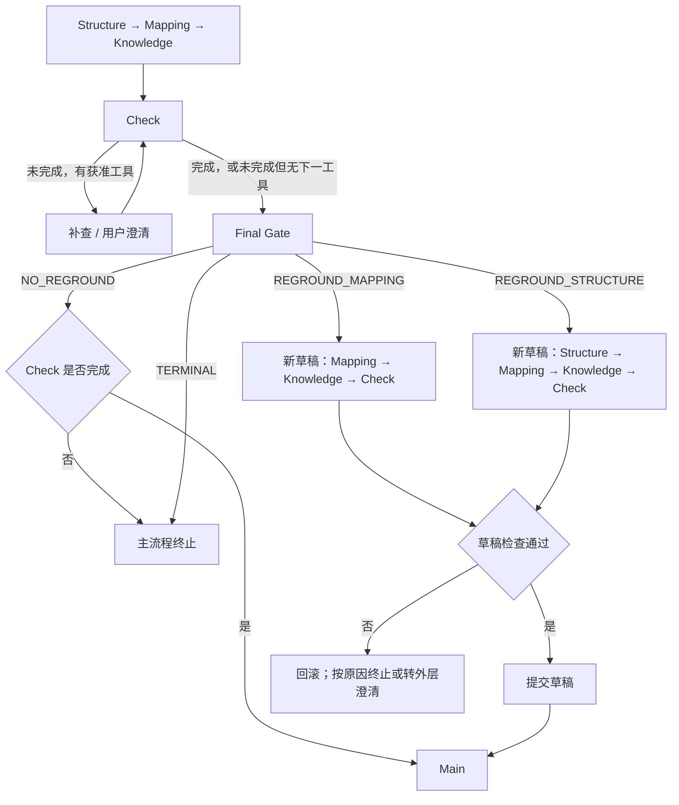

# 框架与数据流

[项目首页](../README.md) · [文档导航](README.md) · [安装与运行](getting-started.md)

本文对应当前发布分支的 a-interact 路径，并以启用 Final Gate 和 fallback 的 Full600 配置为准。默认不开启所有实验开关，不能只看模块是否存在就判断它会运行。

## 四维信息

系统先取官方工具返回的证据，再由三个阶段整理四个维度：

| 阶段 | 输入证据 | 输出 |
| --- | --- | --- |
| Structure | 原请求、后续问题、schema；后续轮次还包括已有状态与澄清 | `tables`、`join_keys` |
| Mapping | 完整请求、Structure 范围、字段说明；重做时还有新澄清及官方知识 | `column_mapping`，以及单独记录的未解决概念 |
| Knowledge | 请求、已有状态、可见的官方知识定义和相关字段说明 | `domain_knowledge` |

启动取证顺序是 `get_schema → get_all_column_meanings → get_all_knowledge_definitions`。这些是官方工具调用，不是三个阶段各自无限查库。工具返回仍受任务可见范围及 benchmark mask 限制。

四维状态只保存整理结果，不保存整份原始 schema、模型推理或全部工具历史。字段为 `null` 表示尚未判断，`[]` 表示已判断但无需该项，非空列表表示已有内容。

Mapping 无法确定的概念记录在 `unresolved_mappings`，它不是第五个状态维度。原因限定为用户意图不清、缺少直接字段证据、缺少派生规则、表范围不足。该记录由 Mapping 负责解决，Check 不能仅凭“看起来够了”直接删除。

实现：[状态定义](../valibra_agent/sql_grounding/models.py)、[阶段 Prompt 与解析](../valibra_agent/sql_grounding/updater.py)、[状态更新校验](../valibra_agent/sql_grounding/service.py)。

## Check 与 Gate

Check 判断已有信息能否支持完整任务，而不仅是“是否找到了字段”。它还检查业务规则、过滤条件、用户参数及输出要求等。判断仍由模型完成，确定性校验只能约束结构和权限，不能保证语义没有遗漏。

Check 可以提出以下补查；runtime 再检查参数、权限、重复请求、次数和预算：

| 工具 | 用途 |
| --- | --- |
| `get_column_meaning` | 补查指定字段含义或枚举 |
| `get_all_external_knowledge_names` | 查找可用的知识条目 |
| `get_knowledge_definition` | 获取指定知识的定义 |
| `ask_user` | 澄清用户意图或参数 |
| `execute_sql` | 在受控范围内补查数据库事实 |

Check 未完成且仍有合法的下一工具时，先补查再检查。一次正式 Check 返回完成，或未完成但没有下一工具时，才进入启用的 Final Gate；解析失败、预算等错误也可能提前结束流程。

`NO_REGROUND` 只表示不重做，不表示允许不完整信息进入 Main。Check 一直未完成时，系统不会无限循环；补查和重做受次数、证据变化及预算限制，无法推进就终止主流程，再由外层判断是否启动 fallback。

重做不是固定“再来一遍四维框架”：表范围不变时只从 Mapping 开始；需要调整表或连接关系时才从 Structure 开始。

## 草稿与用户澄清

重做先在独立草稿中进行。只有最终检查通过才整体提交，失败则保留原正式状态。

如果草稿中的 Check 提出合法澄清，系统先销毁草稿，再向外层发送问题。用户回答保存为状态外的澄清记录，后续创建新草稿，不恢复已回滚的旧草稿。这避免“问完用户后顺手复活半成品”。

实现：[回调与路由](../valibra_agent/grounding_callbacks.py)中的 `_build_final_regrounding_gate_request`、`_resolve_final_regrounding_gate`、`_run_atomic_regrounding_draft`，以及 [service.py](../valibra_agent/sql_grounding/service.py) 中的草稿校验与提交。

## Main 接收到的信息

正式 Main 输入由以下内容组成：

- 原始 Query，以及 P2 的 follow-up；
- 最终四维状态和已回答的用户澄清；
- 公开的执行要求、SQL 标识符提示和剩余 Bird-Coin；
- 当前阶段合法的执行与提交反馈。

它不接收 Grounding 的全部内部推理记录。当前 Main 使用专门的 SQL Writer Prompt，工具只保留 `execute_sql` 和 `submit_sql`；执行用于检查已形成的候选 SQL，不是重新探索 schema 或业务语义。

这与“原官方 Agent 加一份参考材料”的路线不同。后者曾作为实验探索，不能写成当前正式架构。

实现：[Main Prompt 与输入注入](../valibra_agent/grounding_callbacks.py)中的 `_SQL_WRITER_PROMPT`、`_inject_sql_writer_context`、`_filter_writer_tools`；[执行信息整理](../valibra_agent/sql_grounding/main_entry_carrier.py)。

## Fallback

主流程结束、任务尚未完成，且 fallback 已开启、未使用过、剩余预算至少为 3.0 Bird-Coin 时，外层可启动一次官方 Agent 补救。

Fallback 使用独立的 Agent 会话及官方工具，但继续使用同一任务、数据库状态和剩余预算。已经通过的 P1 SQL/产物保留，不重新发放预算，也不返回 Valibra 重跑。

当前冻结版本传入原请求、follow-up、已回答澄清、已通过的 P1 SQL、公开执行要求，以及标为**非权威提示**的失败四维状态。它没有启用“只传原始证据缓存”的新方案，也没有删除 `non_authoritative_failed_4d_state_hint`。

实现：[补救条件与输入](../valibra_agent/fallback/ainteract_fallback.py)、[会话接入](../valibra_agent/adk_runtime.py)。

## P1 到 P2

P1 通过后，官方流程给出后续问题。系统在保留已接受 P1 产物的基础上处理新请求，重新执行对应 Grounding 阶段。

当前发布配置包括三项有限的证据保留机制：

1. P2 Knowledge 默认保留已有知识，再加入本轮选中知识，按 `(kind, content)` 去重。Provider 没有选中旧知识不代表授权删除；可执行 retirement 尚未实现。
2. P2 Check 对同任务 P1 已成功取得的、完全相同参数的 `get_column_meaning` 可精确复用；不复用 SQL 执行结果或用户询问。
3. 当前 P2 Check 循环中已取得的字段证据可有限累计，循环结束即清空，不传入 Main，也不写入四维状态。

这些机制改善信息保留，不负责解决所有字段歧义或保证 P2 通过。

## 阅读代码的顺序

| 内容 | 入口 |
| --- | --- |
| 数据结构、合法值与权限 | [models.py](../valibra_agent/sql_grounding/models.py) |
| Prompt、输入构造、响应解析 | [updater.py](../valibra_agent/sql_grounding/updater.py) |
| 状态变更、知识保留、草稿提交 | [service.py](../valibra_agent/sql_grounding/service.py) |
| 工具调度、Check/Gate、Main 交接 | [grounding_callbacks.py](../valibra_agent/grounding_callbacks.py) |
| Agent 会话及 fallback 接入 | [adk_runtime.py](../valibra_agent/adk_runtime.py) |
| 官方工具实现 | [system_agent/tools.py](../system_agent/tools.py) |
| SQL 执行及评测 | [db_environment/server.py](../db_environment/server.py) |

阅读当前流程时，以这些实现和发布清单为准；早期阶段文件名、注释中的版本号及历史验收状态不代表当前开关设置。
